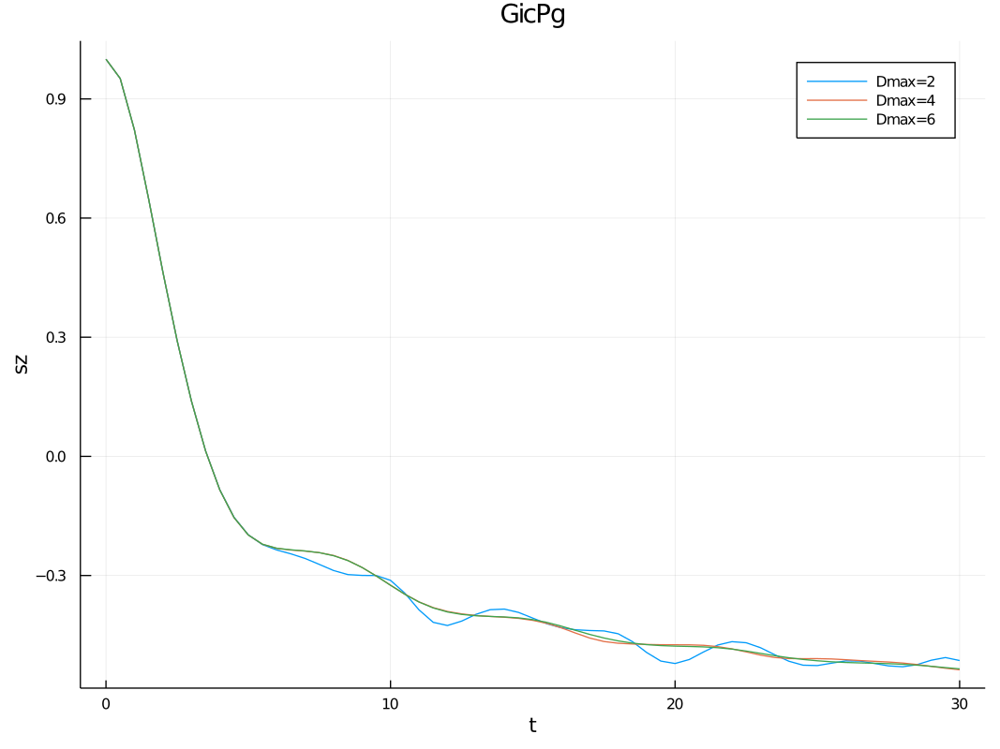
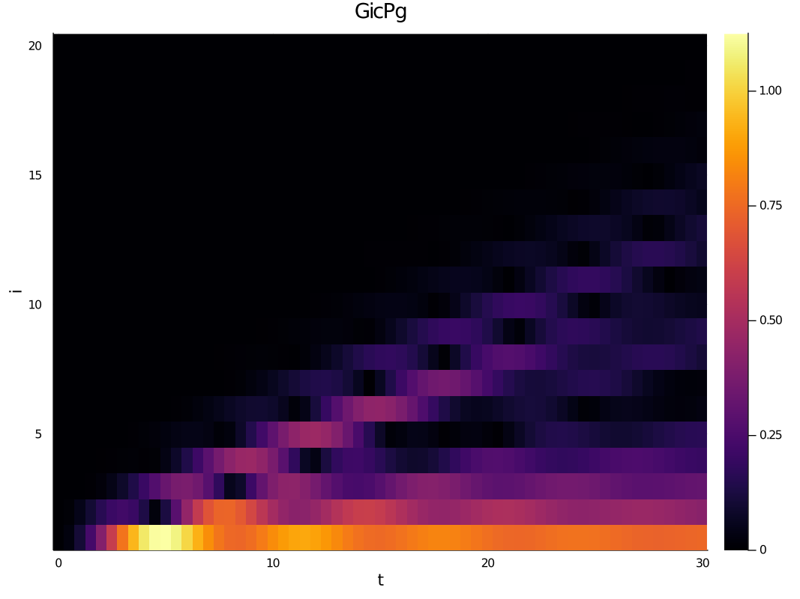

# The Spin-Boson Model

## Context

The Spin-Boson Model (SBM) is a prototypical model in the theory of open quantum systems where a two level system interacts linearly with a bosonic bath ($\hbar = 1$)

```math
	\hat{H} = \frac{\omega_0}{2}\hat{\sigma}_z + \Delta\hat{\sigma}_x + \int_0^{+\infty}\omega \hat{a}^\dagger_\omega\hat{a}_\omega \mathrm{d}\omega + \hat{\sigma}_x\int_0^{+\infty}\sqrt{J(\omega)}(\hat{a}_\omega + \hat{a}^\dagger_\omega)\mathrm{d}\omega
```
Even though this model is fairly simple it is physically very rich and it is not analytically solvable. For these reason it has become a test-bed for numerical methods simulating open quantum systems dynamics in the non-perturbative non-Markovian regime.

For instance when the SD is Ohmic, this model presents a phase transition between a so called localised and a delocalised phase for ``\alpha \approx 1.2``.

Here we break out and comment the script in `MPSDynamics/examples/sbm_zero_temperature.jl` to show how to simulate this model with an Ohmic SD (hard cut-off) using the T-TEDOPA method as implemented in `MPSDynamics.jl`.

The T-TEDOPA method relies on a truncated chain mapping that transform the initial Hamiltonian into
```math
	\hat{H} = \frac{\omega_0}{2} \hat{\sigma}_z + \Delta \hat{\sigma}_x + c_0 \hat{\sigma}_x(\hat{b}_0^\dagger + \hat{b}_0) + \sum_{i=0}^{N-1} t_i (\hat{b}_{i+1}^\dagger \hat{b}_i + \mathrm{h.c.}) + \sum_{i=0}^{N-1} \epsilon_i \hat{b}_i^\dagger \hat{b}_i 
```
## The code

First a multi-line comment introduces the model and the aim of the script.
```julia
#=
    Example of a zero-temperature Spin-Boson Model with an hard cut-off Ohmic spectral density J(ω) = 2αω when ω < ωc and 0 otherwise

    The dynamics is simulated using the T-TEDOPA method that maps the normal modes environment into a non-uniform tight-binding chain.

    H = \\frac{ω_0}{2} σ_z + Δ σ_x + c_0 σ_x(b_0^\\dagger + b_0) + \\sum_{i=0}^{N-1} t_i (b_{i+1}^\\dagger b_i +h.c.) + \\sum_{i=0}^{N-1} ϵ_i b_i^\\dagger b_i 

    Two variants of the one-site Time Dependent Variational Principal (TDVP) are presented for the time evolution of the quantum state.
=#
```
We load the `MPSdynamics.jl` package to be able to perform the simulation, the `Plots.jl` one to plot the results, and the `LaTeXStrings.jl` one to be able to use ``\LaTeX`` in the plots.
```julia
using MPSDynamics, Plots, LaTeXStrings
```
We then define variables for the physical parameters of the simulation.
Among these, two are convergence parameters:

*  `d` is the number of states we retain for the truncated harmonic oscillators representation of environmental modes 
* `N` is the number of chain (environmental) modes we keep. This parameters determines the maximum simulation time of the simulation: indeed excitations that arrive at the end of the chain are reflected towards the system and can lead to unphysical results

```julia
#----------------------------
# Physical parameters
#----------------------------

d = 6 # number of Fock states of the chain modes

N = 30 # length of the chain

α = 0.1 # coupling strength

Δ = 0.0 # tunneling 

ω0 = 0.2 # TLS gap

s = 1 # ohmicity

cpars = chaincoeffs_ohmic(N, α, s) # chain parameters, i.e. on-site energies ϵ_i, hopping energies t_i, and system-chain coupling c_0
```

We set the simulation parameters and choose a time evolution method.
As always for simulations of dynamics, the time step must be chosen wisely. The error of the TDVP methods is ``\mathcal{O}(dt^3)``.
In this example we present two one-site implementation of TDVP that both preserves the unitarity of the evolution:

* the regular one-site method with the keyword `:TDVP1` where all the virtual bonds of the MPS have the same bond dimension ``D``
* the adaptive method with the keyword `:DTDVP` where the bond dimension is locally increased at each time step if the TDVP projection error crosses a threshold value

Logically the constant bond dimension of the MPS for TDVP1 and the threshold of the projection error for DTDVP are their respective convergence parameter. 
```julia
#-----------------------
# Simulation parameters
#-----------------------

dt = 0.5 # time step

tfinal = 30.0 # simulation time

method = :TDVP1 # Regular one-site TDVP (fixed bond dimension)

# method = :DTDVP # Adaptive one-site TDVP (dynamically updating bond dimension)

convparams = [2,4,6] # MPS bond dimension (1TDVP)

# convparams = [1e-2, 1e-3, 1e-4] # threshold value of the projection error (DTDVP)
```
Using `MPSDynamics.jl` built-in methods we define the SBM MPO and the MPS representing the initial state.
This initial state is a product state between the system and the chain. It is constructed using a list of the 'local state' of each site of the MPS, and the dimensions of the physical legs of the MPS are set to be the same as the ones of the MPO.

```julia
#---------------------------
# MPO and initial state MPS
#---------------------------

H = spinbosonmpo(ω0, Δ, d, N, cpars) # MPO representation of the Hamiltonian

ψ = unitcol(1,2) # Initial up-z system state 

A = productstatemps(physdims(H), state=[ψ, fill(unitcol(1,d), N)...]) # MPS representation of |ψ>|Vacuum>
```
We then chose the observables that will be measured during the time evolution after being passed as an argument of the [`MPSDynamics.runsim`](@ref) method.

```julia
#---------------------------
# Definition of observables
#---------------------------

ob1 = OneSiteObservable("sz", sz, 1)

ob2 = OneSiteObservable("chain mode occupation", numb(d), (2,N+1))

ob3 = TwoSiteObservable("SXdisp", sx, disp(d), [1], collect(2:N+1))
```
We run the simulation from `t = 0` to `tfinal` with time-steps of size `dt` using the `method` method.
The `convobs` observables will be measured and stored for the convergence parameters `convparams`, whereas the `obs` observables will only be measured and stored for the most precise convergence parameter.

```julia
#-------------
# Simulation
#------------

A, dat = runsim(dt, tfinal, A, H;
                name = "ohmic spin boson model",
                method = method,
                obs = [ob2,ob3],
                convobs = [ob1],
                params = @LogParams(N, d, α, Δ, ω0, s),
                convparams = convparams,
                verbose = false,
                savebonddims = true, # this keyword argument enables the bond dimension at each time step to be saved when using DTDVP
                save = true,
                plot = true,
                );
```
Finally, we plot the simulation results that are stored in the `dat` dictionnary.

```julia
#----------
# Plots
#----------

method == :TDVP1 && plot(dat["data/times"], dat["convdata/sz"], label=["Dmax = 2" "Dmax = 4" "Dmax = 6"], xlabel=L"t",ylabel=L"\sigma_z")

method == :DTDVP && plot(dat["data/times"], dat["convdata/sz"], label=["p = 1e-2" "p = 1e-3" "p = 1e-4"], xlabel=L"t",ylabel=L"\sigma_z") 

method == :DTDVP && heatmap(dat["data/times"], collect(0:N+1), dat["data/bonddims"], xlabel=L"t",ylabel="bond index")

heatmap(dat["data/times"], collect(1:N), abs.(dat["data/SXdisp"][1,:,:]), xlabel=L"t",ylabel="chain mode")
```




