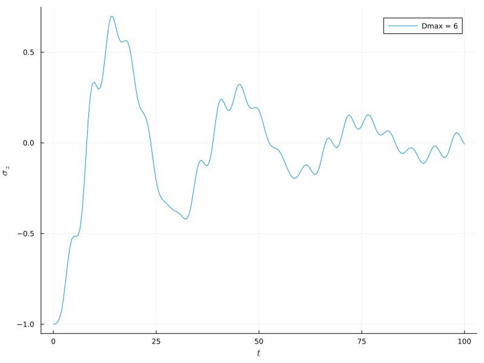
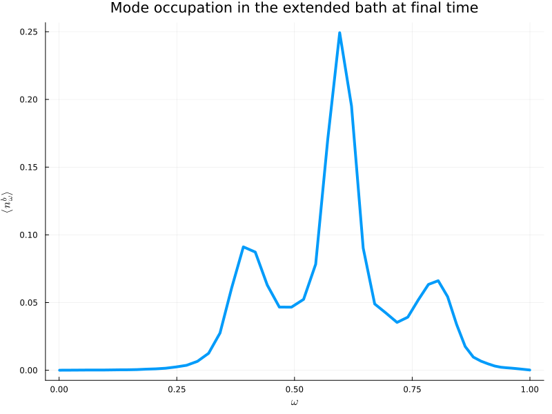

# Time-dependent Hamiltonian

## Context

To simulate a drive or a laser pulse, a time-dependent Hamiltonian is often needed. Here we explain thanks to the script in `MPSDynamics/examples/sbm_Htimedependent.jl` how this type of Hamiltonian can be integrated within the method and applied on a wavefunction. We will take a Spin-Boson Model (SBM) Hamiltonian with an Ohmic spectral density. However, the time-dependency is not model specific and can be adapated for other models. For more information about the SBM, see the dedicated example. For this example, we simulate a drive of the form

```math
        \hat{H}_\text{drive}(t) = \epsilon \hat{\sigma}_x \sin(\omega_\text{drive} t)
```
with ``\epsilon = \frac{2 \pi}{T_\text{Rabi}}`` the amplitude of the drive, ``T_\text{Rabi}`` the Rabi period, and ``\omega_\text{drive}`` the frequency of the drive. The drive is set up to be on resonance with the two-level system.

## The code
First we load the `MPSdynamics.jl` package to be able to perform the simulation, the `Plots.jl` one to plot the results, the `LinearAlgebra.jl` one to perform matrix diagonalization and the `LaTeXStrings.jl` one to be able to use ``\LaTeX`` in the plots. The function [`MPSDynamics.disp`](@ref) is also imported.

```julia
using MPSDynamics, Plots, LaTeXStrings, LinearAlgebra

import MPSDynamics: disp
```

We then define variables for the physical parameters of the simulation.
Among these, three are convergence parameters:

*  `d` is the number of states we retain for the truncated harmonic oscillators representation of environmental modes
* `N` is the number of chain (environmental) modes we keep. This parameters determines the maximum simulation time of the simulation: indeed excitations that arrive at the end of the chain are reflected towards the system and can lead to unphysical results

```julia
#----------------------------
# Physical parameters
#----------------------------

d = 4 # number of Fock states of the chain modes

N = 60 # length of the chain

α = 0.005 # coupling strength

Δ = 0.0 # tunneling 

ω0 = 0.6 # TLS gap

s = 1 # ohmicity

cpars = chaincoeffs_ohmic(N, α, s) # chain parameters, i.e. on-site energies ϵ_i, hopping energies t_i, and system-chain coupling c_0

Trabi = 30.0 # Rabi period of the drive

ϵ = 2*pi / Trabi # Intensity of the drive

ωdrive = ω0 # Frequency of the drive
```
We set the simulation parameters and choose a time evolution method.
As always for simulations of dynamics, the time step must be chosen wisely. The error of the TDVP methods is ``\mathcal{O}(dt^3)``.
In this example we present only one-site implementation of TDVP that preserves the unitarity of the evolution:

* the regular one-site method with the keyword `:TDVP1` where all the virtual bonds of the MPS have the same bond dimension ``D``

Logically the constant bond dimension of the MPS for TDVP1 is the respective convergence parameter.

```julia
#-----------------------
# Simulation parameters
#-----------------------

dt = 0.5 # time step

tfinal = 100.0 # simulation time

method = :TDVP1 # time-evolution method

D = [6] # MPS bond dimension
```
We then set the time-dependent MPO. The variable `Ndrive` represents the site of the MPO where the operator of the time-dependent part acts. For this example, the two-level system is at the first site of the MPS. 

```julia
#---------------------------
# MPO time-dependent
#---------------------------

timelist = collect(0:dt:tfinal)
numsteps = length(timelist)-1

#### #=
    #Example of a Ht = σ_x ϵ sin(ωdrive t) drive on the TLS
    #To comment if the example of (a+a^\dagger) drive is used

Ndrive = 1 #Number of the site on which the drive is applied. Here Ndrive=1 for the TLS
Ht = [ϵ*sx*sin(ωdrive*tstep) for tstep in timelist] # Time-dependent Hamiltonian term

#### =#
```
The drive Hamiltonian can also be applied on several sites. The example of a Hamiltonian of the type :
```math
        \hat{H}_\text{drive}(t) = \epsilon (\hat{a}_{Ndrive} + \hat{a_{Ndrive}^\dagger}) \sin(\omega_\text{drive} t)
```
is illustrated in the following commented section. In order to drive one environment frequency, the operators have to be translated into chain operators. To try this type of driving, the previous section has to be commented.
```julia
#=
   # Example of a Ht = (a_{Ndrive_star}+a_{Ndrive_star}^\dagger) ϵ sin(ωdrive t) drive on the (Ndrive_star)th mode. 
   # The operators have to be transformed to drive the chain modes instead of the mode of the initial Hamiltonian
   # This example assumes the same dimensions for all Ndrive and that applies to a chain at the right of the system.
   # If it is not the case, the run_1TDVP loop involved when timedep=true has to be modified
   # To comment if the example of σ_x drive is used

Ndrive_star = 10
Ndrive = collect(2:N+1)

# Construct the chain Hamiltonian to write the star - chain transition matrix 
t_chain=cpars[2][1:N-1] ; e_chain=cpars[1][1:N]
hmat_chain = MPSDynamics.diagm(0=>e_chain, 1=>t_chain, -1=>t_chain)
U_chain  = eigen(hmat_chain).vectors

print("\n Driving of the mode of frequency : ",MPSDynamics.eigenchain(cpars, nummodes=N).values[Ndrive_star])

Ht = Vector{Any}(undef,N+1)

# Construct the chain operators that correspond to star operators for (a_{Ndrive_star}+a_{Ndrive_star}^\dagger
for i in Ndrive
    local anih_Ndrive = (U_chain[i-1,Ndrive_star]*anih(d))
    local crea_Ndrive = (conj(U_chain[i-1,Ndrive_star])*crea(d))
    local Ht_Ndrive = [ϵ*(anih_Ndrive+crea_Ndrive)*sin(ωdrive*tstep) for tstep in timelist]
    Ht[i] = Ht_Ndrive
end

=#
```

Using `MPSDynamics.jl` built-in methods we define the SBM MPO and the MPS representing the initial state.
This initial state is a product state between the system and the chain. It is constructed using a list of the 'local state' of each site of the MPS, and the dimensions of the physical legs of the MPS are set to be the same as the ones of the MPO.


In this part, the time-dependent terms of the MPO are stored in a list. This enables to add these terms to the MPO elements at each timestep and avoid the calculation of an entire new MPO. This way is not cumbersome since it adds a matrix sum at each time step.

```julia
#---------------------------
# MPO and initial state MPS
#---------------------------

H = spinbosonmpo(ω0, Δ, d, N, cpars) # MPO representation of the Hamiltonian

ψ = unitcol(2,2) # Initial down-z system state 

A = productstatemps(physdims(H), state=[ψ, fill(unitcol(1,d), N)...]) # MPS representation of |ψ>|Vacuum>
```
We then choose the observables that will be stored in the data and the [`MPSDynamics.runsim`](@ref) arguments.
```julia
#---------------------------
# Definition of observables
#---------------------------

ob1 = OneSiteObservable("sz", sz, 1)

ob2 = TwoSiteObservable("cdagc", crea(d), anih(d), collect(2:N+1), collect(2:N+1))

ob3 = TwoSiteObservable("SXdisp", sx, disp(d), [1], collect(2:N+1))

```
[`MPSDynamics.runsim`](@ref) is called to perform the dynamics. The argument `timedep` is set up to true and `Ndrive` and `Htime` are provided in the kwargs. 
```julia
#-------------
# Simulation
#------------

A, dat = runsim(dt, tfinal, A, H;
                name = "Driving field on ohmic spin boson model",
                method = method,
                obs = [ob1],
                convobs = [ob1],
                params = @LogParams(N, d, α, Δ, ω0, s),
                convparams = D,
                timedep = true, # the Hamiltonian is time dependent
                Ndrive = Ndrive, # the first site of the MPS/MPO (i.e. the system) is concerned
                Htime = Ht, # list of time-dependent terms
                verbose = false,
                save = true,
                plot = true,
                );
```
Eventually, the stored observables can be represented. For more information about the chain observables, see [Inspecting the bath by undoing the chain mapping] 
```julia

#----------
# Plots
#----------

plot(dat["data/times"], dat["data/sz"], label="Dmax = $(D...)", xlabel=L"t",ylabel=L"\sigma_z", title="")

bath_occup = mapslices(X -> MPSDynamics.measuremodes(X, cpars[1], cpars[2]), dat["data/cdagc"], dims = [1,2])
omeg = MPSDynamics.eigenchain(cpars, nummodes=N).values

plot(omeg, bath_occup[:, :, end], lw=4, xlabel=L"\omega", ylabel=L"\langle n^b_\omega \rangle",
title="Mode occupation in the extended bath at final time", legend=:none)
```




